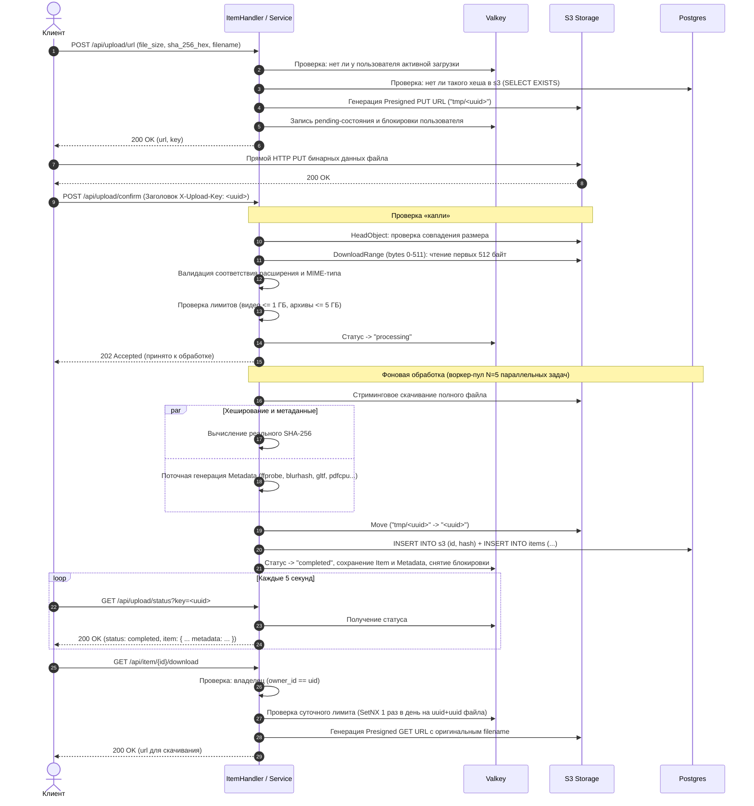

При ошибке в POST /api/upload/confirm (Заголовок X-Upload-Key: <uuid>), Проверка «капли», удаляется в s3 если причина связанна с пользователем. Если изза сервера (internalError, все 500), то пользователь может заного попытатся отправить этот запрос
При ошибке в GET /api/upload/status?key=<uuid>, Если ошибка связанна с пользователем опять же удаляется из s3, если нет и ошибка сервера то может еще пытатся пока не получит 400 или 200